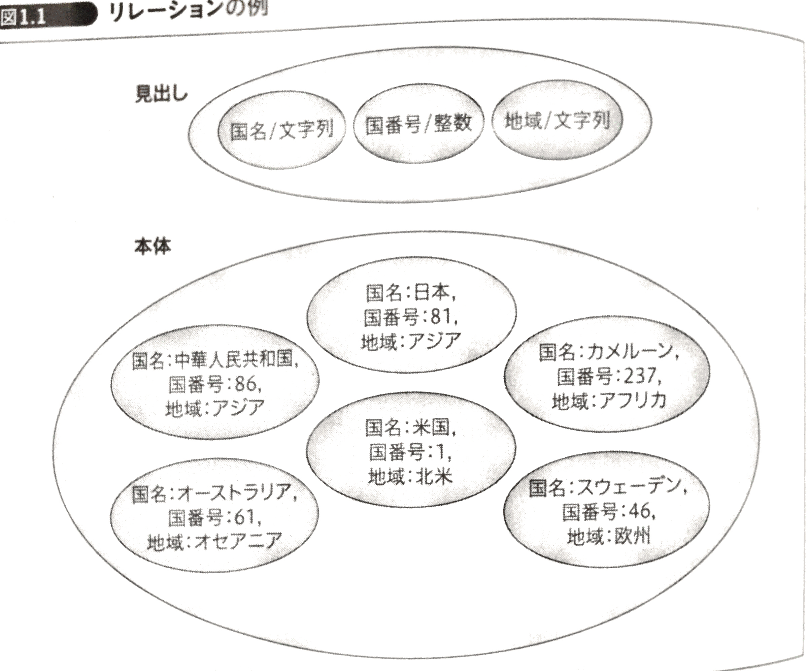
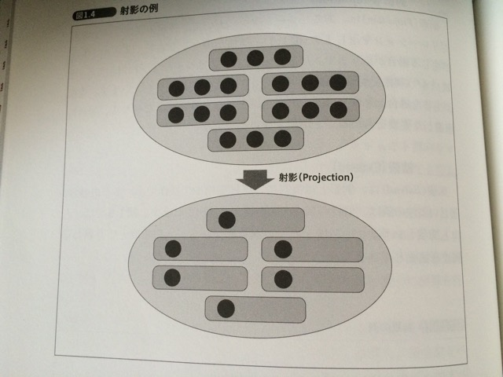
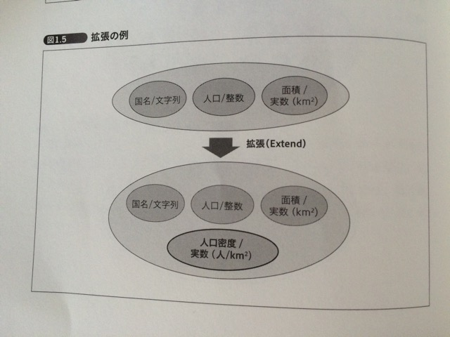
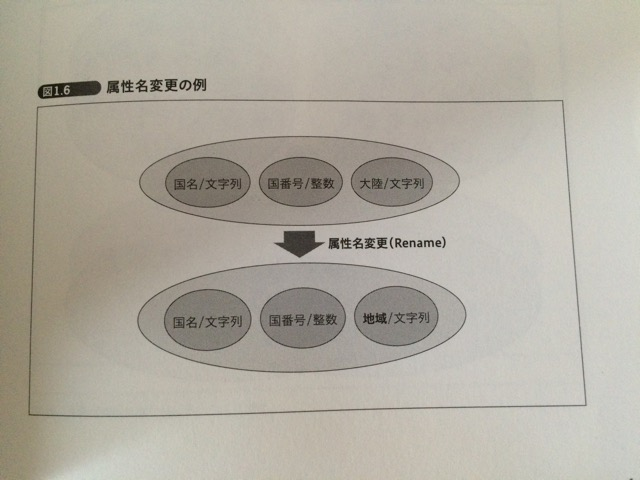
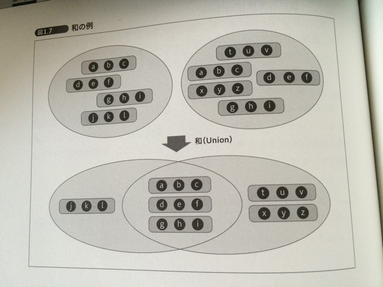
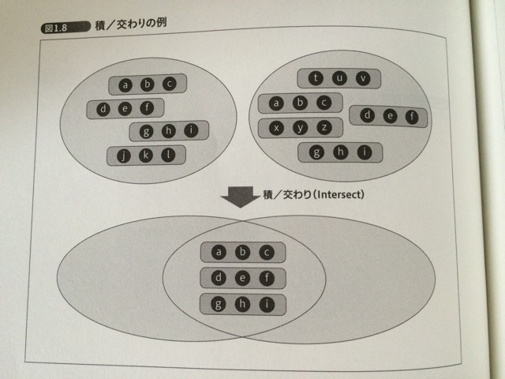
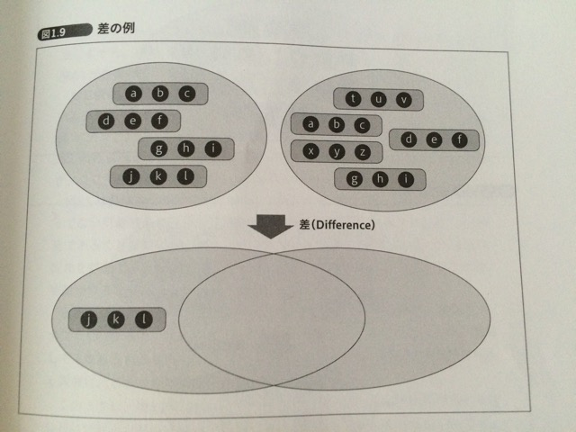
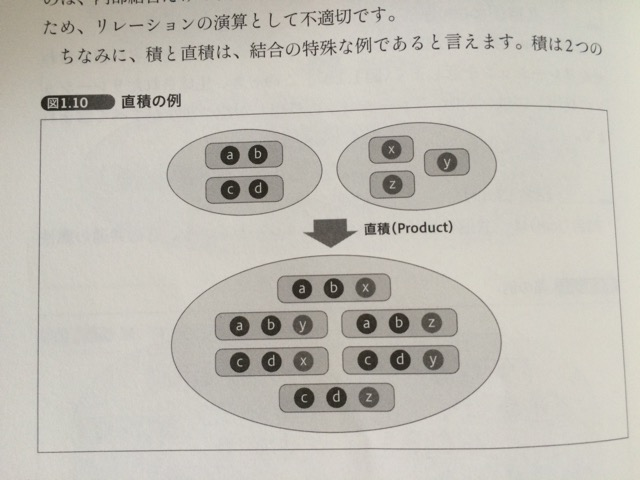

# SQL とリレーショナルモデル

## そもそも SQL って？

* SQL を身につけたからといって、リレーショナルモデルが身につくわけではない
* SQL はリレーショナルモデルをベースにした問い合わせ言語だが、リレーショナルモデルを忠実に再現しているわけではない
* それどころか、SQL の柔軟性が高いために逆にリレーショナルモデルから大きく逸脱した使い方もできてしまう
* DB を単なるデータの入れ物だと捉えることは、RDB に対するよくある間違い
    * インデックスさえ効いていれば良いとか
    * DB 設計全般をおざなりにしてしまうとか
* SQL はリレーショナルモデルをベースに設計されているので、リレーショナルモデルに沿った演算が得意である。それから外れると可読性も悪くなり、バグの温床になる

## リレーショナルモデル

* ER 図とリレーショナルモデルは何の関係もない
* ER 図こそリレーショナルモデルを表現しているツールだ、としている解説は誤り
* リレーショナルモデルが表すデータモデルは設計という意味ではなく、データをどのように表現するか、という概念の話

### リレーションの定義

* SQL においてリレーションに相当するものは、**テーブル**
* リレーションは、見出しと本体のペアで構成される
* 見出し
    * n 個の属性の集合
    * 属性の定義
        * 名前
        * データ型
    * 属性は、SQL では列（column）に対応する
* 本体
    * 属性値の集合＝組（タプル）
    * 属性値
        * 名前とデータ型が見出しで指定されたものとそれぞれ一致する
    * タプルは、SQL では行（row）に対応する
* リレーションの例
    * 
* SQL とリレーショナルモデルでそれぞれ対応する概念があるのに名称が違うのは、性質が異なるから

| リレーショナルモデル | SQL      |
| -------------------- | -------- |
| リレーション         | テーブル |
| タプル               | 行       |
| 属性                 | カラム   |

### 集合とリレーショナルモデル

* リレーションも集合の一種
* 集合とは
    * その要素が集合に含まれているかどうかを不確定要素がなく判定できる
        * つまり、**未知**のものを集合に含めることはできない
    * 集合の要素が重複してはいけない
        * つまり、「何個含まれているか」がその後の演算に影響を与えてはいけない
    * 集合の要素はそれ以上分解できない
* リレーショナルモデルは、集合論に根ざしたデータモデルなので、集合が何であるかを理解することが、リレーショナルモデルを理解する助けになる

#### リレーショナルモデルと NULL

* NULL とは未知の値を示すマーカー
* リレーションは集合の一種
    * つまり、集合の一種であるリレーションに未知のものである NULL を含めることはできない
* リレーショナルモデルを正しく実践するには、NULL は排除すべき
* NULL を排除しながら、現実的な問題にどうやって立ち向かうのかを知る

#### 有限集合と無限集合

* リレーショナルモデルが扱うのは有限集合
* コンピュータで表現できるものは、どんな種類のものも有限のもの
* ストレージの限界容量が大きくなれば表現できる範囲は大きくできるが、それでも無限ではない

### リレーションの演算

* データをリレーションとして表現しているなら、それに対する演算はクエリ
* リレーショナルモデルは、リレーションを単位としてさまざまな演算を用いて問い合わせを行うデータモデル
    * リレーションを使った演算を行うから、リレーショナルモデルという名称がついている
* リレーションの本体は、タプルの集合
    * つまり、それに対する演算も、集合論をベースとしたものになる

#### 制限(Restrict)

* あるリレーションのうち、特定の条件に合うタプルだけを含んだリレーションを返す
* 実行した結果は、元のリレーションの部分集合
* 

#### 射影(Projection)

* あるリレーションにおいて、特定の属性だけを含んだリレーションを返す
* 属性が少なくなるとタプルに重複が生じる場合があるが、その場合は同一のタプルとみなされる
* 

#### 拡張(Extend)

* 射影とは逆に、属性を増やす操作
* 多くの場合、新しい属性の値は、既存の属性の値を使って算出される
* 

#### 属性名変更(Rename)

* 単に属性の名称を変更する操作
* 

#### 和(Union)

* ２つのリレーションに含まれる、全てのタプルで構成されるリレーションを返す（和集合）
* ２つのリレーションに共通の属性値が含まれる場合、重複が解消された状態になる
* 

#### 積／交わり(Intersect)

* ２つのリレーションの交わり（共通部分）になっているリレーションを返す
* 

#### 差(Difference)

* ２つのリレーションのうち、片方のリレーションにのみ含まれるタプルで構成されるリレーションを返す
* どちらのリレーションから引くかによって結果が変わる
* 

#### 直積(Product)

* ある２つのリレーションのタプルをそれぞれ組み合わせたリレーションを返す
* ２つのリレーションの見出しが持つ属性が全て含まれる
* 

#### 結合(Join)

* 共通の属性を持つ２つのリレーションを、その共通の属性の値が同じタプル同士を組み合わせたリレーションを返す
* 結果として残るタプルは、２つのリレーションで共通の属性において、同じ値が存在するものだけ
* マッチする値が存在しないタプルは、結果から除外される
* 
* SQL では内部結合と呼ばれる
* リレーショナルモデルに存在するのは内部結合だけで、外部結合は結果に NULL を含む可能性があるため、リレーションの演算としては不適切
* 積と直積は、結合の特殊な例であるといえる
    * 積は２つのリレーションに含まれる属性が全て共通であるケース
    * 直積は共通の属性が存在しないケース
* RDB の性能を引き出すには、リレーションの演算に基づいて SQL を記述する必要がある

##### 要素に NULL が含まれていると…

* NULL は値がわからないことを示す（不定）
* 値が定まっていないので、集合に含めることができない
* 演算時の条件としても評価ができない
* リレーションの演算結果も、どうなるかわからない

### クロージャという性質

* 演算の入力も出力も同じデータ構造を持ったものになる性質のことをクロージャと呼ぶ
* ラムダ式や無名関数のことではない
* クロージャである演算は、結果に対して別のリレーションを演算したり、他のリレーションの結果をさらに演算したりすることができる
* リレーションの演算だけを用いて、複雑な演算を表現することができる

### リレーショナルモデルにおけるデータ型

* リレーショナルモデル自身には、どのデータ型を使うべきかという決まりはない
* どのように使えるかが決まっているだけで、どのように使うべきかはアプリケーションが決めること

#### データ型と変数

* 変数は変化するもの
* 値は不変のもの

#### ドメインとは

* データ型とは、その変数に代入される可能性のある値の有限集合
* リレーショナルモデルにおいて、データ型はドメインとも呼ばれる
    * 値とは集合の要素一つ一つ
    * 変数とはある時点において、その集合から要素を１つ選択したもの
* データ型が有限集合であることは、タプルが取りうる値はその有限集合の直積によって導かれる
* リレーションとは、属性のドメインの直積から、特定のタプルだけを選び出して構成した集合とも言える
* つまり、リレーショナルモデルはリレーションを構成する**見出し**、**本体**、**タプル**だけでなく、**属性のデータ型**すらも集合になっている

## SQL におけるリレーション操作

### SELECT の基本形

```sql
SELECT カラムのリスト
FROM テーブルのリスト
WHERE 検索条件
```

* ３項目全てがそれぞれリレーションの代数的演算に相当する
    * カラムのリストは射影
    * テーブルのリストは直積
    * 検索条件は制限
* 演算が評価される順序（論理的な順序）
    1. テーブルのリスト（直積）
    2. 検索条件（制限）
    3. カラムのリスト（射影）
* ただし実際に RDB によってどの順序で実行されるかは無関係で、オプティマイザが最適化を施して順序の入れ替えを行う（物理的な順序）

##### 拡張の評価順

```sql
SELECT name, weight, weight * 2.2 AS weight_lb
FROM t
WHERE weight_lb > 100;
```

上記の SQL はエラーになる。（ならない RDB 製品もある）

拡張の評価は射影の直前に行われるため、制限の条件評価時には評価されないため。

#### INSERT （挿入）

* リレーショナルモデルに更新という概念は存在しない。なぜなら、**リレーションは値**だから
* SQL では、テーブルが値と変数両方の役割を持っている
* リレーショナルモデルでは、リレーションを格納する変数は *Relvar* （関係変数）と呼ぶ
* SQL におけるテーブルの更新処理とは、*Relvar* としてテーブルに割り当てられた、リレーションの値を変更すること
* つまり、`INSERT` とは、*Relvar* の値（＝リレーション）を、そのリレーションに対して新しく `INSERT` するタプル（≒行）を追加した、リレーションと置き換えるという操作に相当

```sql
INSERT INTO t (c1, c2, c3) VALUES (1, 2, 3);
```

上記の SQL は、テーブル `t` の `Relvar` を `R`、新しく挿入する行に対応するタプルを `T` とすると、和集合`∪`を用いて次の式で表せる。

```
R := R ∪ { T }
```

#### DELETE（削除）

* `INSERT` が和集合であれば、`DELETE` は差集合
* 元のリレーション（＝ `Relvar` に代入されている値）から、`WHERE` 句の条件である `c1 = 100` に該当するタプルの集合（つまり、元のリレーションの部分集合）となるリレーションとの**差集合**を、`Relvar` に代入するのと等価

```sql
DELETE FROM t WHERE c1 = 100;
```

上記の SQL は、次のような式で表せる。

```
R := R - { T }
```

DELETE のさらに直接的な表現としては、`DELETE` は、`Relvar` をWHERE句の条件を満たさないタプルからなるリレーションで置き換えることと等価であるといえる。

#### UPDATE（更新）

* 元のリレーションに含まれるタプルのうち、`WHERE` 区の条件に適合するタプルの値を、`SET` 句の指示に従って更新する操作
* リレーション、つまり値そのものは更新できないため、タプルの値を書き換えるのはリレーショナルモデル的に誤り

```sql
UPDATE t SET c1 = 1 WHERE c2 = 123;
```

上記の SQL は、以下の様な操作で表現できる。

1. 元のリレーションから、WHERE 句の条件に適合するタプルからなるリレーションとの差集合を取る
2. 結果に対し、差をとったリレーション（WHERE 句の条件に適合するタプルからなるリレーション）に修正を加えたリレーションとの和集合を導く
3. 結果の和集合を Relvar に代入する

```
R := ( R - { T1 } ) ∪ { T2 }
```

SQL でも `UPDATE` は `DELETE` と `INSERT` の組み合わせで表現できるが、それと近いイメージ。

## SQL にあってリレーショナルモデルにないもの

### 要素の重複

* SQL では、テーブル内に同じ行が存在してもよい。一意性制約があれば重複した行は存在できないが制約がなければ可能
* **テーブルはそもそも集合ではない**
    * あえて言えば多重集合
    * 多重集合と集合とは性質が異なるので、リレーショナルモデルと SQL の性質も異なる
* SQL をリレーショナルモデルに沿って使うには、テーブルを集合と同じように使う必要がある

### 要素間の順序

* 集合には、要素間に順序がない
* リレーションや、タプル、見出しに含まれる要素にも順序はない
* SQL には、順序が存在する
* カラムは定義された順に並んでいるし、行をソートすることもできる。クエリを実行した結果も指定された順序で並んでいる
* SQL をリレーショナルモデルに沿って使うには、行やカラムの位置に依存したクエリを書くべきではない
    * `ROWNUM` や `ORDER BY 1`、`resultSet.getString(1)` など

### リレーションの更新

* リレーションは値であるため、更新できない
* テーブルが値と変数の両方の機能を兼ね備えているため、そこを意識するすべき

### トランザクション

* トランザクションは SQL 仕様の一部だが、リレーショナルモデルとトランザクションは別の独立した概念
* RDB を使いこなすためには両輪であり、相補的な関係である
* リレーションはそもそも更新できないため、トランザクションの ACID 特性とは一切関係がない
* 値と変数の両方の性質を兼ね備えたテーブルという概念がある SQL だからこそ意味のある概念

### ストアドプロシージャ

* リレーショナルモデルにはプロシージャは存在しない
* カーソルをループで処理するという操作はリレーショナルモデルではなく、テーブルに対してループで何らかの処理を行うということは、集合演算を真っ向から否定する行為ですらある
* RDB の真骨頂はストアドプロシージャではなく、リレーショナルモデル

### NULL

* 集合には、NULL という概念はなく、ただ要素が格納されているだけ
* 要素が存在していれば集合に含まれており、そうでなければ集合に該当する要素は含まれない
* NULL は未知である、あるいは値が存在しないという意味の特別な記号であり、値ではないので、NULL を集合に含めることはできない

##### リレーショナルモデルは古典的か

* 現実のアプリケーションをリレーショナルモデルに適合させることが難しい、現実的ではないという主張がある
* リレーショナルモデルの解釈自体を変えることは誤り
* リレーショナルモデルは数学（集合論）に裏付けされた強力なデータモデル
* クエリ（問い合わせ）の正しさも数学によって保証されている
* 重要な事は、リレーショナルモデルの限界を知ること
* 適用できる部分と適用できない部分を見極めること